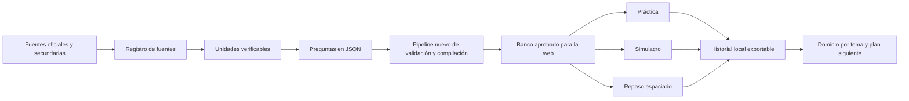

# Aplicativo de estudio para el Concurso PGN 2026

Estado: **definición de producto y arquitectura**  
Fecha: **3 de septiembre de 2026**  
Nombre de trabajo: **Mérito PGN**

## 1. Resumen ejecutivo

Se propone construir desde cero un aplicativo privado de práctica y simulación
para uso personal en el Concurso Abierto de Méritos de la Procuraduría General
de la Nación 2026. El producto tomará únicamente aprendizajes funcionales del
repositorio `examen euroinnova`; no copiará su código ni quedará condicionado por
su arquitectura. El banco de preguntas se diseñará para soportar múltiples
fuentes, trazabilidad normativa, versiones, cargos diferentes y revisión de
calidad.

La prioridad no es desarrollar una plataforma grande. La prioridad es producir
un **dataset confiable que ayude a estudiar**. El primer MVP debe estar listo en
un máximo de 10 a 12 horas de desarrollo; después, la mayor parte del tiempo
debe dedicarse a estudiar y mejorar preguntas. Construir indefinidamente el
aplicativo sería una forma costosa de posponer la preparación.

Decisiones confirmadas:

- Uso personal y privado durante la convocatoria.
- Implementación nueva desde cero dentro de este repositorio.
- Acceso desde computador y celular mediante una PWA responsive.
- Preguntas originales derivadas de fuentes oficiales, no copiadas de bancos
  comerciales.
- Uso de IA para redactar borradores desde fragmentos oficiales identificados;
  ninguna pregunta entra al banco aprobado sin revisión humana.
- Misión Mérito y otros preparadores se usan para descubrir temas y comparar
  funcionalidades, nunca como autoridad normativa.

El alcance del primer MVP es el entrenador esencial. La PWA se publicará como
sitio estático gratuito y los datos de progreso serán locales, sin backend ni
sincronización automática entre dispositivos. La exportación/importación será el
mecanismo opcional para trasladar progreso.

## 2. Problema que resuelve

Las fichas del concurso enumeran conocimientos amplios, pero no entregan un
banco oficial de preguntas. Las normas son extensas, cambian con el tiempo y
una misma persona puede considerar cargos de datos, software, infraestructura o
asesoría. Estudiar únicamente leyendo documentos dificulta:

- identificar qué temas están dominados;
- practicar decisiones situacionales;
- recordar normas y conceptos a largo plazo;
- separar contenido común del específico de cada cargo;
- detectar preguntas ambiguas o desactualizadas;
- concentrar el repaso en errores reales.

El aplicativo debe convertir fuentes verificables en práctica medible, no
intentar adivinar o reproducir el examen reservado.

## 3. Objetivos y límites

### Objetivos del MVP

1. Practicar por tema, cargo o bloque transversal.
2. Ejecutar simulacros configurables sin mostrar respuestas durante el intento.
3. Explicar la respuesta correcta y cada distractor con referencia a la fuente.
4. Registrar aciertos, errores, confianza y tiempo de respuesta.
5. Programar repasos de preguntas falladas o respondidas con duda.
6. Mostrar dominio por tema y alertar sobre fuentes pendientes de revisión.
7. Actualizar el banco sin modificar manualmente el código del frontend.

### Fuera del alcance inicial

- Predecir preguntas reales o afirmar que una pregunta es oficial.
- Plataforma comercial, pagos, comunidad o perfiles públicos.
- Chat con IA en tiempo real.
- Scraping de cursos, videos o bancos pagos.
- Aplicación móvil nativa.
- Backend multiusuario y administración compleja.

## 4. Hallazgos del repositorio `examen euroinnova`

### Arquitectura actual

- Frontend estático en HTML, CSS y JavaScript.
- Excel como fuente original.
- Compilador Python que genera `app/data/question-bank.js`.
- Dos modos: práctica con explicación y simulacro sin retroalimentación
  inmediata.
- Opciones barajadas en cada intento.
- Progreso y bloqueos guardados en `localStorage`.
- Vista del banco y de preguntas excluidas.
- Pruebas automáticas para opciones vacías, repetidas, preguntas duplicadas,
  claves conflictivas y material explicativo.
- Despliegue preview privado en Vercel para evitar publicar el banco.

El libro contiene ocho módulos con 150 filas fuente por módulo. El compilador
actual produce **1.174 preguntas elegibles** después de excluir duplicados,
opciones faltantes y otros conflictos.

### Patrones que conviene conservar, sin reutilizar código

| Componente | Decisión | Motivo |
| --- | --- | --- |
| Modos práctica y simulacro | Replicar el concepto | El flujo coincide con el nuevo propósito. |
| Barajado de opciones | Implementar de nuevo | Evita memorizar la posición de la clave. |
| Informe final | Rediseñar | Debe agregar tema, tiempo, confianza y fuente. |
| Panel de exclusiones | Replicar el concepto | Es una buena herramienta de control editorial. |
| Pipeline de compilación | Diseñar de nuevo | Debe aceptar un esquema nuevo y múltiples archivos fuente. |
| Pruebas de integridad | Redefinir y ampliar | Deben cubrir defectos estructurales, semánticos y normativos. |
| Persistencia local | Elegir según dispositivos | `IndexedDB` es preferible si se adopta una PWA. |
| Excel como única fuente | Sustituir | No representa bien citas múltiples, vigencia, versiones y revisiones. |

### Limitaciones que no deben heredarse

- La respuesta correcta queda incluida en un archivo servido al navegador.
  Esto es aceptable para uso privado, pero no protege un banco comercial.
- El progreso depende de un navegador y puede perderse al borrar sus datos.
- No existe trazabilidad normativa por artículo, página o versión.
- No hay taxonomía jerárquica, dificultad, confianza ni repetición espaciada.
- Algunas explicaciones se construyen desde guías temáticas y no mediante una
  revisión individual de cada pregunta.
- El esquema de cinco columnas funciona para un Excel académico, pero resulta
  insuficiente para preguntas jurídicas y situacionales auditables.

## 5. Principios del nuevo dataset

1. **Fuente antes que pregunta:** ninguna pregunta publicable sin fuente y
   localizador verificables.
2. **Vigencia explícita:** registrar fecha, versión y estado de cada norma o
   documento.
3. **Pregunta original:** no copiar bancos comerciales ni transcripciones de
   influencers.
4. **Explicación completa:** justificar clave y distractores.
5. **Separación de estados:** borrador, revisión, aprobado, rechazado o retirado.
6. **Trazabilidad de IA:** identificar qué contenido fue generado o reformulado
   con IA y quién lo revisó.
7. **Contenido modular:** núcleo común independiente del cargo y módulos
   técnicos seleccionables.
8. **Configuración externa:** cantidad de preguntas, tiempo y distribución del
   simulacro no deben quedar fijos en el código.

## 6. Jerarquía de fuentes

### Nivel A - Fuentes oficiales específicas del concurso

Son la fuente de verdad y tienen prioridad sobre cualquier curso:

- Resoluciones PGN 076, 108 y 133 de 2026.
- Compilado y fichas vigentes de las convocatorias.
- Portal `meritoconstruyendoexcelencia.com.co`.
- Guía de Orientación al Aspirante cuando sea publicada.
- Citaciones, avisos y modificaciones posteriores.
- Diccionario de Competencias Comportamentales de la PGN.

### Nivel B - Fuentes oficiales de contenido

- Constitución Política.
- Decreto Ley 262 de 2000 y Decreto Ley 1851 de 2021.
- Ley 1952 de 2019, modificada por la Ley 2094 de 2021.
- Ley 80 de 1993, Ley 1150 de 2007 y Decreto 1082 de 2015.
- Función Pública y Aula Virtual del Estado.
- Instituto de Estudios del Ministerio Público.
- Colombia Compra Eficiente, Archivo General de la Nación, MinTIC, SIC y SUIN,
  según el tema.

### Nivel C - Referencias educativas institucionales

- Guías de otros concursos públicos para aprender formatos de preguntas.
- Cursos abiertos de MIPG, integridad, transparencia, empleo público y gestión
  documental.
- Material histórico de la PGN, claramente marcado como histórico.

Estas fuentes ayudan a enseñar y diseñar ejercicios, pero no sustituyen las
reglas del concurso PGN 2026.

### Nivel D - Páginas, cursos e influencers

El mercado revisado ofrece cursos, bootcamps y bancos de 50 a más de 300
preguntas. Es útil para identificar temas, estilos de explicación y necesidades
de usuarios. No demuestra que las preguntas sean oficiales, correctas o estén
vigentes.

Reglas para usar estas fuentes:

- Guardar enlace, autor, fecha y tema observado.
- No copiar preguntas, explicaciones, videos, PDFs o material pago.
- Contrastar cada afirmación con una fuente A o B.
- Crear una pregunta original desde la norma verificada.
- No publicar material adquirido si su licencia no lo permite.
- Marcar cualquier afirmación no confirmada como `secondary_unverified`.

#### Evaluación puntual de Misión Mérito

La revisión pública del 3 de septiembre de 2026 encontró:

- El perfil [Misión Mérito en Instagram](https://www.instagram.com/misionmerito/?hl=es)
  se presenta como apoyo para concursos de mérito de la CNSC y tiene una
  audiencia amplia. Sus publicaciones recientes incluyen fechas de inscripción,
  requisitos documentales, empleos sin experiencia y oferta de cursos.
- Su [curso gratuito](https://misionmerito.com/curso/gratis/) anuncia 70 horas e
  incluye bibliografía general, simulacros, competencias comportamentales,
  herramientas de IA, consejos y acceso a una comunidad de Telegram.
- El contenido gratuito observado es principalmente general para concursos CNSC;
  no debe asumirse que representa el régimen especial, el temario ni el formato
  definitivo de la PGN 2026.
- Existe un componente comercial claro: varias publicaciones llevan a cursos de
  educación informal o ETDH. Esto no invalida el contenido, pero obliga a
  contrastar toda afirmación con fuentes oficiales.
- TikTok impidió una auditoría automatizada de su contenido público. Cualquier
  video que se use para descubrir un tema deberá registrarse mediante su enlace
  directo y luego verificarse contra una fuente de nivel A o B.

Conclusión: Misión Mérito es una referencia útil para entender necesidades del
aspirante, formatos de explicación y temas en circulación. No es una fuente
válida para copiar preguntas ni para afirmar reglas del concurso.

## 7. Estrategia de adquisición del dataset

### Paso 1 - Registro de fuentes

Crear un inventario de documentos antes de generar preguntas. Para cada fuente:

- identificador estable;
- título;
- organismo o autor;
- URL o ruta local;
- tipo de fuente y nivel de autoridad;
- fecha de publicación y consulta;
- versión;
- vigencia;
- hash del archivo;
- licencia o restricción de uso;
- estado de revisión.

### Paso 2 - Taxonomía

Construir una jerarquía basada en los conocimientos de las fichas:

```text
comun
|- procuraduria_y_estado
|- derecho_disciplinario
|- gestion_publica_y_mipg
|- contratacion_estatal
|- atencion_transparencia_y_datos
|- gestion_documental
|- ofimatica_y_sistemas_de_gestion
`- competencias_comportamentales

tecnico
|- datos_y_analitica
|- software_e_interoperabilidad
`- infraestructura_nube_y_ciberseguridad
```

Cada pregunta puede pertenecer a más de una convocatoria, pero debe tener un
tema principal único para calcular dominio sin duplicidad.

### Paso 3 - Extracción de unidades verificables

No generar preguntas directamente desde documentos completos. Dividir las
fuentes en unidades pequeñas:

- artículo o grupo corto de artículos;
- función institucional;
- concepto y definición;
- procedimiento con sus pasos;
- regla y excepción;
- escenario de aplicación;
- conocimiento técnico puntual.

Cada unidad conserva su localizador: artículo, sección, página o encabezado.

### Paso 4 - Creación de preguntas

Tipos iniciales:

| Tipo | Proporción | Ejemplo de habilidad |
| --- | ---: | --- |
| Comprensión conceptual | 25 % | Diferenciar función preventiva y disciplinaria. |
| Aplicación normativa | 30 % | Elegir actuación correcta en un caso. |
| Análisis técnico | 25 % | Datos, software, seguridad o infraestructura. |
| Competencia comportamental | 15 % | Priorizar una conducta eficaz, legal y trazable. |
| Lectura e interpretación | 5 % | Extraer una conclusión de tabla, indicador o texto. |

Evitar preguntas puramente memorísticas cuando la ficha permite evaluar
aplicación. Incluir memoria solo para estructura, funciones, términos o reglas
que realmente deban recordarse.

La IA puede generar borradores, distractores y explicaciones únicamente a partir
de una unidad verificable previamente registrada. Cada salida se guarda con
estado `draft_ai`, fuente, localizador y fecha de generación. La IA no aprueba
preguntas, no decide vigencia normativa y no puede inventar una cita faltante.
Solo una revisión humana puede cambiar el estado a `approved`.

### Paso 5 - Revisión en dos pasadas

1. **Revisión factual:** la clave y la explicación coinciden con la fuente.
2. **Revisión psicométrica/editorial:** hay una sola mejor respuesta, los
   distractores son plausibles y el enunciado no contiene pistas accidentales.

Una pregunta generada con IA no pasa a `approved` hasta completar ambas.

### Paso 6 - Publicación y retiro

El compilador genera solo preguntas `approved`. Si una fuente cambia, sus
preguntas pasan a `needs_review` y quedan fuera de nuevos simulacros hasta ser
revalidadas.

## 8. Tamaño objetivo del banco

### MVP inicial

Crear **200 preguntas aprobadas**:

| Bloque | Cantidad |
| --- | ---: |
| Institución, Estado y función pública | 35 |
| Derecho disciplinario | 35 |
| Gestión pública, MIPG e integridad | 20 |
| Contratación estatal | 20 |
| Atención, transparencia, datos y documentos | 20 |
| Competencias comportamentales | 20 |
| Módulo técnico del cargo seleccionado | 50 |

### Meta antes de la prueba

Llegar a **400 preguntas aprobadas**, no simplemente generadas. Es preferible
tener 250 buenas preguntas con fuentes que 1.000 ambiguas o desactualizadas.

## 9. Esquema de datos propuesto

### `sources.json`

```json
{
  "id": "pgn-res-076-2026",
  "title": "Resolución 076 de 2026",
  "publisher": "Procuraduría General de la Nación",
  "authorityTier": "A",
  "url": "https://www.procuraduria.gov.co/Documents/2026/Concurso-de-meritos/Resolucio%CC%81n%20No.%20076%20de%2024%20de%20marzo%20de%202026.pdf",
  "localPath": "02_fuentes_oficiales/normatividad/pdf/resolucion_076_2026.pdf",
  "publishedAt": "2026-03-24",
  "retrievedAt": "2026-09-03",
  "version": "original",
  "effective": true,
  "contentHash": "<sha256-calculado-durante-la-ingesta>",
  "redistribution": "to_verify",
  "reviewStatus": "verified"
}
```

### `questions/*.json`

```json
{
  "id": "PGN-COM-DIS-0001",
  "status": "approved",
  "module": "comun",
  "topic": "derecho_disciplinario",
  "subtopic": "principios",
  "questionType": "application",
  "difficulty": 2,
  "stem": "En un caso hipotético...",
  "options": [
    {"id": "A", "text": "...", "rationale": "..."},
    {"id": "B", "text": "...", "rationale": "..."},
    {"id": "C", "text": "...", "rationale": "..."},
    {"id": "D", "text": "...", "rationale": "..."}
  ],
  "correctOptionId": "B",
  "explanation": "...",
  "sources": [
    {
      "sourceId": "ley-1952-2019",
      "locator": "artículo ...",
      "supports": "correct_answer"
    }
  ],
  "targetCalls": ["121-2026", "126-2026", "127-2026"],
  "createdMethod": "ai_draft_human_reviewed",
  "reviewedBy": "manual-reviewer",
  "reviewedAt": "2026-09-03",
  "validFrom": "2026-09-03",
  "tags": ["principios", "caso"]
}
```

### Datos de intentos

```json
{
  "questionId": "PGN-COM-DIS-0001",
  "attemptedAt": "2026-09-03T20:00:00-05:00",
  "selectedOptionId": "C",
  "correct": false,
  "confidence": 2,
  "responseTimeSeconds": 74,
  "mode": "practice",
  "examId": null
}
```

La confianza se registra en una escala simple: `1 = adiviné`, `2 = dudé`,
`3 = estaba seguro`. Una respuesta correcta con confianza 1 debe programarse
para repaso.

## 10. Arquitectura propuesta



### Estructura de repositorio sugerida

```text
concursoProcuraduria/
|- app/
|  |- src/
|  |  |- features/
|  |  |- components/
|  |  |- storage/
|  |  `- domain/
|  `- public/data/
|- content/
|  |- sources.json
|  |- taxonomy.json
|  |- exam-profiles.json
|  `- questions/
|     |- common.json
|     |- data.json
|     |- software.json
|     `- cloud-security.json
|- pipeline/
|  |- build_question_bank.py
|  |- validate_sources.py
|  `- report_dataset_quality.py
|- tests/
|  `- test_question_bank.py
|- 02_fuentes_oficiales/
|- 03_convocatorias/
`- 06_preparacion/
```

### Decisión tecnológica para el MVP

La decisión confirmada es una **PWA nueva con React, TypeScript y Vite** para
computador y celular. En el MVP, el progreso se guarda en `IndexedDB` y puede
exportarse/importarse. Un pipeline independiente en Python transforma y valida
las fuentes y publica un JSON versionado para la app.

Esta opción permite estudiar en computador y celular, funciona sin conexión y
mantiene separada la edición del dataset de la experiencia de estudio. La
implementación debe empezar limpia; del proyecto Euroinnova se reutilizan
criterios y aprendizajes, no archivos ni componentes.

No se justifica inicialmente .NET, PostgreSQL ni autenticación propia para un
único usuario. Sin backend, cada dispositivo tendrá progreso independiente; la
exportación/importación permite trasladarlo manualmente. Si se exige
sincronización automática, será necesario añadir almacenamiento remoto,
autenticación y manejo seguro de secretos.

### Hosting elegido

Usar **Vercel Hobby** como primera opción de despliegue. Es adecuado para este
proyecto personal, genera HTTPS y despliega automáticamente los cambios. Puede
conectarse a un repositorio privado de una cuenta personal cuyo propietario sea
el autor de los despliegues; Hobby no admite repositorios privados pertenecientes
a organizaciones. El frontend y el banco compilado sí serán accesibles desde la
URL pública, aunque el repositorio permanezca privado.

Alternativas consideradas:

| Servicio | Uso propuesto | Evaluación |
| --- | --- | --- |
| Vercel Hobby | Opción principal | Configuración simple para React/Vite y uso personal gratuito. |
| Cloudflare Pages | Alternativa | Muy buen hosting estático gratuito; Cloudflare recomienda Workers para proyectos nuevos. |
| GitHub Pages | No preferido | Simple, pero ofrece menos separación entre publicación y repositorio en el plan gratuito. |

No se debe incluir en el bundle ningún dato personal, token, contraseña ni clave
de API. El contenido publicado se considerará visible para quien conozca la URL,
aunque el aplicativo esté destinado a un solo usuario. El `service worker`
permitirá continuar estudiando sin conexión después de la primera carga.

Si más adelante se decide publicar para otros usuarios, evaluar:

- frontend React/TypeScript;
- API en .NET;
- PostgreSQL;
- autenticación;
- respuestas y claves servidas desde backend;
- permisos y licenciamiento de contenido.

## 11. Perfiles de simulacro

La cantidad de preguntas y el tiempo deben vivir en `exam-profiles.json` porque
la Guía de Orientación todavía puede definirlos. Perfil provisional:

```json
{
  "id": "professional-provisional",
  "label": "Profesional/Asesor - provisional",
  "questionCount": 60,
  "durationMinutes": 90,
  "passingKnowledgeScore": 65,
  "weights": {
    "knowledge": 0.70,
    "behavioral": 0.20,
    "background": 0.10
  },
  "officialFormatConfirmed": false
}
```

No presentar `60 preguntas/90 minutos` como formato oficial: es únicamente una
configuración inicial para entrenar hasta que se publique la guía.

## 12. Funciones del MVP

### Alternativas de alcance

| Alternativa | Incluye | Ventaja | Costo o riesgo |
| --- | --- | --- | --- |
| A. Entrenador esencial | Práctica, simulacro, explicaciones con fuente, repaso de errores, confianza, estadísticas y respaldo manual. | Entrega valor rápido y concentra el esfuerzo en el dataset. | No incluye notas, fichas ni tutor conversacional. |
| B. Sistema de estudio | Todo lo anterior, más fichas, notas, marcadores, plan semanal y lectura organizada de fuentes. | Reúne estudio y práctica en un solo lugar. | Aumenta el desarrollo antes de disponer de un banco sólido. |
| C. Tutor con IA | Todo lo anterior, más conversación sobre documentos y generación dinámica de ejercicios. | Permite exploración y explicaciones personalizadas. | Requiere API, conexión, secretos, costo y controles contra respuestas sin respaldo. |

Decisión: construir la alternativa A. Las funciones de B y C quedan fuera del
MVP. La IA ya aprobada se usa en el pipeline editorial para crear borradores; no
habrá tutor conversacional durante esta fase.

### Pantalla inicial

- progreso general;
- dominio por tema;
- fuentes que requieren revisión;
- siguiente sesión recomendada;
- acceso a práctica, simulacro, errores y banco.

### Práctica

- selección por tema, convocatoria, dificultad o preguntas pendientes;
- respuesta inmediata;
- explicación de todas las opciones;
- enlace y localizador de la fuente;
- registro de confianza;
- opción para reportar ambigüedad.

### Simulacro

- preguntas y opciones barajadas;
- tiempo configurable;
- sin retroalimentación durante el intento;
- navegación y marcación para revisar;
- informe por tema, tipo, confianza y tiempo;
- revisión posterior con fuentes.

### Repaso inteligente

Prioridad sugerida:

1. respuesta incorrecta;
2. correcta con confianza baja;
3. fuente modificada o pregunta reabierta;
4. tema con precisión inferior al 75 %;
5. pregunta no vista recientemente.

Intervalos iniciales: 1, 3, 7 y 14 días. El algoritmo puede mantenerse simple;
no es necesario implementar SM-2 en el primer MVP.

### Exportación

- descargar progreso en JSON o CSV;
- importar respaldo;
- no incluir documentos personales ni hoja de vida;
- conservar historial aunque cambie el navegador.

## 13. Validaciones automáticas del dataset

El compilador debe fallar cuando:

- falta enunciado, clave, explicación o fuente;
- no existen exactamente cuatro opciones;
- hay opciones vacías o repetidas;
- la clave no corresponde a una opción;
- el enunciado está duplicado con otra clave;
- una fuente no existe en el registro;
- el localizador está vacío;
- una pregunta `approved` conserva una fuente `secondary_unverified` como único
  respaldo;
- una pregunta retirada aparece en el banco generado;
- una norma marcada como no vigente continúa soportando una pregunta activa;
- el cargo o tema no existe en la taxonomía.

Alertas que no bloquean:

- enunciado demasiado largo;
- distractor mucho más largo que los demás;
- palabras absolutas como “siempre” o “nunca” que puedan revelar la clave;
- uso excesivo de negaciones;
- dificultad o cargo sin revisar;
- más de 20 % de respuestas correctas en la misma posición antes de barajar.

## 14. Control de calidad editorial

Lista de comprobación para aprobar una pregunta:

- [ ] Evalúa un objetivo concreto.
- [ ] Tiene una sola mejor respuesta.
- [ ] No depende de información no incluida en el caso.
- [ ] No copia material comercial.
- [ ] La clave está apoyada por fuente oficial vigente.
- [ ] Incluye artículo, página o sección.
- [ ] Cada distractor es plausible y su error puede explicarse.
- [ ] Evita pistas gramaticales o de longitud.
- [ ] La dificultad corresponde al razonamiento requerido.
- [ ] Fue probada al menos una vez antes de entrar a un simulacro.

## 15. Métricas de utilidad

El producto será útil si mejora el aprendizaje, no por cantidad de pantallas.

| Métrica | Meta inicial |
| --- | ---: |
| Preguntas aprobadas | 200 en MVP; 400 antes de la prueba |
| Preguntas con fuente y localizador | 100 % |
| Preguntas con explicación de distractores | 100 % |
| Precisión en simulacros | Tendencia hacia 80 % |
| Preguntas acertadas con confianza baja | Menos de 10 % |
| Temas por debajo de 75 % | Cero antes de la prueba |
| Fuentes vigentes pendientes de revisión | Cero antes de simulacro final |

## 16. Riesgos y mitigaciones

| Riesgo | Impacto | Mitigación |
| --- | --- | --- |
| Sobreconstruir y no estudiar | Alto | Limitar MVP a 10-12 horas y trabajar por entregas pequeñas. |
| Preguntas inventadas o ambiguas | Alto | Fuente obligatoria y revisión en dos pasadas. |
| Cambio de guía o ejes | Alto | Perfiles configurables y versionado de fuentes. |
| Copiar material comercial | Alto | Usarlo solo como referencia de mercado; crear contenido original. |
| Norma desactualizada | Alto | Vigencia, hash y estado `needs_review`. |
| Exponer el banco | Medio | Uso local o despliegue privado; nunca producción pública desde la carpeta del banco. |
| Perder progreso del navegador | Medio | Exportación/importación desde el MVP. |
| Banco sesgado a memoria literal | Medio | Mezclar comprensión, aplicación, técnica y casos. |
| Asumir formato no publicado | Medio | Configuración provisional claramente rotulada. |

## 17. Roadmap

### Fase 0 - Dataset mínimo, 1 día

- Crear `sources.json`, `taxonomy.json` y esquema de preguntas.
- Registrar fichas 121, 126, 127, 07, 51 y 52.
- Registrar resoluciones y normas base.
- Convertir las 25 preguntas del diagnóstico al nuevo esquema.
- Ejecutar validaciones.

### Fase 1 - MVP nuevo, 2 a 4 días

- Crear desde cero la PWA y su modelo de dominio.
- Agregar fuentes, confianza, tiempo y temas.
- Implementar exportación/importación.
- Crear práctica y simulacro provisional.
- Llegar a 100 preguntas aprobadas.

### Fase 2 - Banco útil, semanas 1 a 3

- Llegar a 200 preguntas.
- Incorporar repetición espaciada.
- Añadir dashboard por tema.
- Probar preguntas y corregir ambigüedades.

### Fase 3 - Después de la inscripción

- Seleccionar el módulo técnico definitivo.
- Incorporar 50 preguntas específicas iniciales.
- Ajustar distribución según la ficha elegida.

### Fase 4 - Publicación de la guía

- Registrar la guía como fuente nivel A.
- Actualizar número de preguntas, tiempo, formato y ejes.
- Marcar preguntas afectadas como `needs_review`.
- Ejecutar un reporte completo de calidad.

## 18. Primer backlog priorizado

| Prioridad | Historia | Criterio de aceptación |
| ---: | --- | --- |
| P0 | Registrar una fuente | Guarda autoridad, URL/ruta, versión, vigencia y hash. |
| P0 | Crear una pregunta | Exige cuatro opciones, clave, explicación y fuente. |
| P0 | Validar el banco | Excluye o bloquea defectos estructurales y duplicados. |
| P0 | Practicar por tema | Muestra retroalimentación y fuente después de responder. |
| P0 | Hacer simulacro | No revela claves y entrega informe final. |
| P0 | Guardar progreso | Persiste intento, confianza, tiempo y errores. |
| P1 | Repasar errores | Ordena preguntas por prioridad de repaso. |
| P1 | Exportar/importar | Recupera progreso en otro navegador. |
| P1 | Ver dominio | Resume precisión, confianza y cobertura por tema. |
| P1 | Reportar ambigüedad | Envía pregunta a revisión y la excluye si procede. |
| P2 | Actualizar fuentes | Detecta cambios de hash y reabre preguntas afectadas. |
| P0 | PWA | Permite uso responsive e instalación en computador y celular. |

## 19. Criterios para empezar a programar

Ya están decididos:

1. uso exclusivamente personal y privado;
2. implementación desde cero dentro de `concursoProcuraduria`;
3. comienzo con el núcleo común, independiente de aplicar a pregrado o posgrado;
4. fuentes oficiales como autoridad y preparadores solo como referencias;
5. Misión Mérito como primera referencia de mercado evaluada;
6. acceso en computador y celular mediante PWA;
7. IA autorizada para borradores con cita y aprobación humana obligatoria;
8. alternativa A, entrenador esencial, como alcance del MVP;
9. progreso local, sin backend ni sincronización automática;
10. publicación estática gratuita, inicialmente en Vercel Hobby.

No quedan decisiones de producto bloqueantes. La primera entrega debe
concentrarse en el esquema del dataset, el registro de fuentes y un conjunto
pequeño de preguntas aprobadas antes de ampliar la interfaz.

## 20. Fuentes iniciales verificadas

- Concurso PGN 2026: https://www.procuraduria.gov.co/procuraduria/concurso/Pages/default.aspx
- Portal del proceso: https://meritoconstruyendoexcelencia.com.co/
- Resolución 076 de 2026: https://www.procuraduria.gov.co/Documents/2026/Concurso-de-meritos/Resolucio%CC%81n%20No.%20076%20de%2024%20de%20marzo%20de%202026.pdf
- Decreto Ley 262 de 2000: https://www.funcionpublica.gov.co/eva/gestornormativo/norma.php?i=40618
- Decreto Ley 1851 de 2021: https://www.funcionpublica.gov.co/eva/gestornormativo/norma.php?i=175150
- Código General Disciplinario: https://www.funcionpublica.gov.co/eva/gestornormativo/norma.php?i=90324
- Diccionario de competencias: https://www.procuraduria.gov.co/portal/media/file/DICCIONARIO%20DE%20COMPETENCIAS%20COMPORTAMENTALES%205-JUL-12.pdf
- Capacitación del IEMP: https://iemp.gov.co/capacitaciones/
- Aula Virtual del Estado: https://www.funcionpublica.gov.co/eva/eva/aula-virtual

Referencias de mercado revisadas, no fuentes de verdad:

- [Misión Mérito](https://misionmerito.com/curso/gratis/), curso gratuito general,
  simulacros, bibliografía, competencias y comunidad.
- [ProConcursosCOL](https://proconcursoscol.com/landing), simulacros diarios,
  historial y varios tipos de prueba anunciados.
- [Instituto SCA](https://institutosca.com/examenes/colombia-procuraduria-general-2026.html),
  paquete anunciado de simulaciones de 50 preguntas.
- [Concursa con Éxito](https://concursaconexito.com.co/producto/procuraduria-general/),
  banco anunciado de más de 300 preguntas.
- [RELE](https://relecoaching.com.co/076/), bootcamp jurídico y simulacros
  situacionales.
- [Guías y Simulacros](https://guiasysimulacros.com/cursos/procurador-judicial-i-y-ii-pgn),
  referencia de preparación para cargos jurídicos.
- [Material Concursos](https://materialconcursos.com.co/procuraduria-profesional/),
  referencia comercial de preparación para nivel profesional.
- [Construyendo Méritos](https://meritoconstruyendoexcelencia.com/), contenido y
  servicios de preparación para concursos.

Lo que conviene comparar de estas páginas no son sus preguntas, sino sus
funciones: simulacro cronometrado, frecuencia de práctica, informe de errores,
organización por competencias, seguimiento histórico y experiencia móvil.

Referencias técnicas de hosting consultadas el 3 de septiembre de 2026:

- [Vercel Hobby](https://vercel.com/docs/plans/hobby), plan gratuito para uso
  personal.
- [Límites de Vercel](https://vercel.com/docs/limits), límites operativos del
  plan Hobby.
- [Integración Git de Vercel](https://vercel.com/docs/git), restricciones de
  Hobby para repositorios privados y organizaciones.
- [Límites de Cloudflare Pages](https://developers.cloudflare.com/pages/platform/limits/),
  alternativa gratuita para contenido estático.
- [Planes de GitHub](https://docs.github.com/en/get-started/learning-about-github/githubs-plans),
  condiciones aplicables a repositorios y GitHub Pages.

## 21. Preguntas abiertas

No quedan preguntas abiertas de producto. Los datos del concurso que todavía no
sean oficiales —como cantidad exacta de preguntas, duración y distribución
definitiva— permanecerán configurables y marcados como provisionales hasta la
publicación de la guía de orientación.
